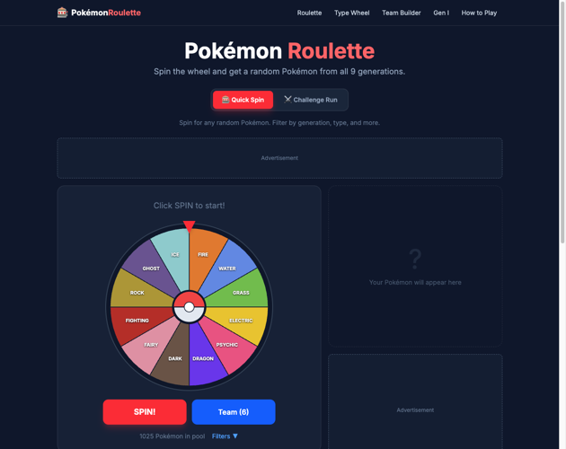

# Pokemon Roulette

A browser-based Pokémon team roulette for Nuzlocke runs, challenge play, and random team generation.

## Live Website

https://pokemonroulette.com/

## What It Does

Pokemon Roulette helps players generate random Pokémon choices for challenge runs and team-building scenarios.

You can use it to:

- spin for a random Pokémon starter
- build themed or randomized teams
- create challenge-ready lineups for Nuzlocke-style play
- explore team ideas across multiple generations

## Key Features

- Random Pokémon roulette wheel
- Team generation for challenge runs
- Support for multiple Pokémon generations
- Fast, browser-based experience
- Built for casual play, challenge runs, and fan experimentation

## Project Status

Active and live.

## Note

This repository is a public showcase page for the project.  
The production codebase is maintained privately.

## Project Status

✅ Live and actively maintained.

This repository is a public showcase page for Pokemon Roulette.  

## Visit

https://pokemonroulette.com/
